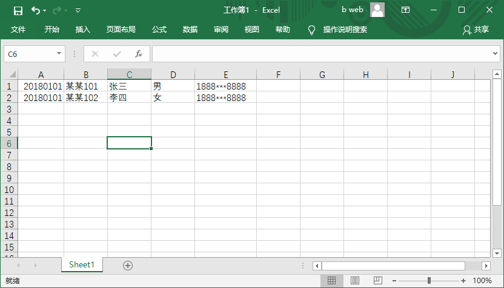
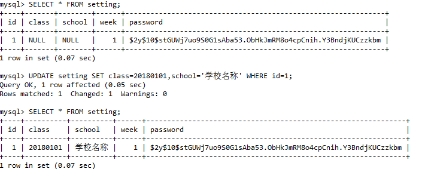

# 安装和使用

### 1 创建数据库

### 2 修改项目配置文件

> 打开项目中的config/database.php

```php
'mysql' => [
    'driver' => 'mysql',
    'url' => env('DATABASE_URL'),
    'host' => env('DB_HOST', '你的服务器地址'),
    'port' => env('DB_PORT', '3306'),
    'database' => env('DB_DATABASE', '数据库名'),
    'username' => env('DB_USERNAME', '数据库账号'),
    'password' => env('DB_PASSWORD', '数据库密码'),
    ...
]
```

### 3 创建数据表

```
$ php artisan migrate:install
Migration table created successfully.

$ php artisan migrate
Migrating: 2020_01_01_202543_create_setting_table
Migrated:  2020_01_01_202543_create_setting_table (0.23 seconds)
Migrating: 2020_01_02_155314_create_record_table
Migrated:  2020_01_02_155314_create_record_table (0.47 seconds)
Migrating: 2020_01_08_153138_create_user_table
Migrated:  2020_01_08_153138_create_user_table (0.14 seconds)
```

### 4.导入用户信息
> 导入信息条件
> >  文件扩展名必须是*.xls，*.xlsx
> >
> >  > 内容要求，如下图所示。



打开http://你的网站/overnight/import这个地址选择excel文件即可。

**注意：**如果没有密码请在密码框中输入你要设置的密码即可。

### 5.导出数据

> 在导出数据之前需要在数据库中配置好信息
>
> 打开数据库管理工具找到你创建的数据库，找到名为setting的数据表。
>
> 如下图所示
>



打开http://你的网站/overnight/export这个地址，输入密码后点击提交就可以到出excel文件的数据。

**注意：**只有周五才可以导出文件。